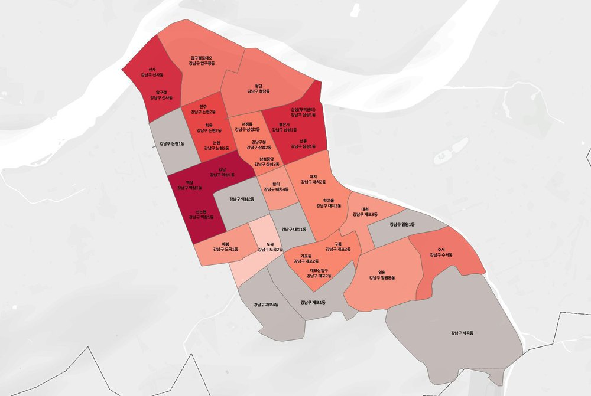
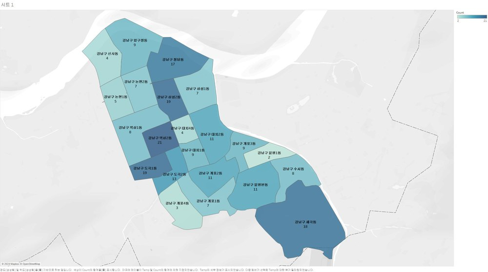
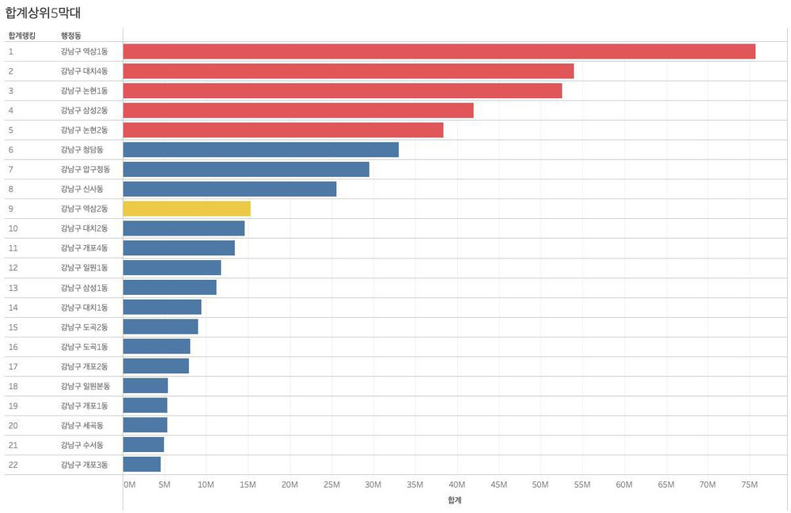
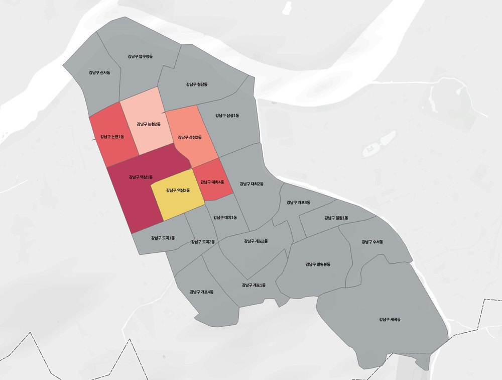
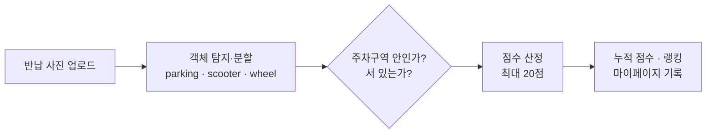
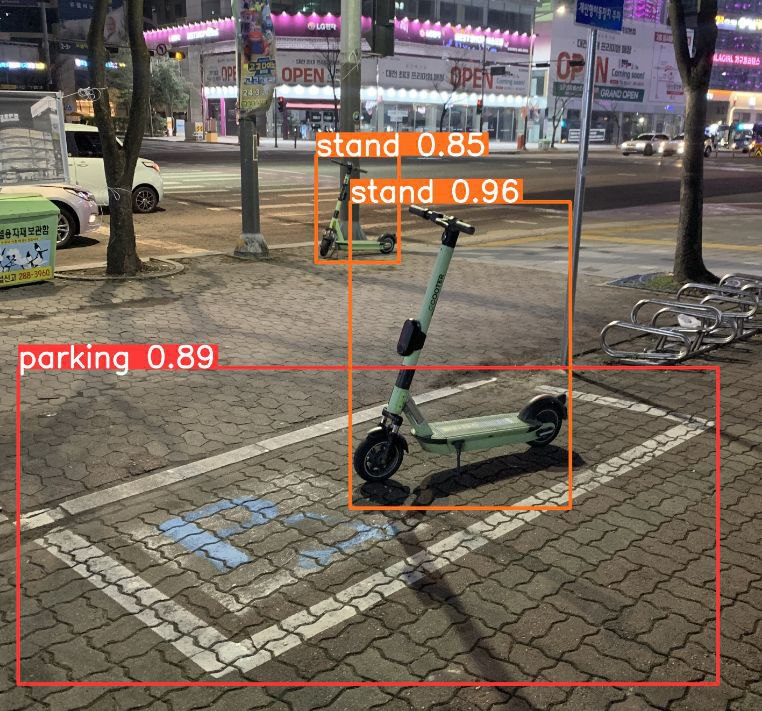
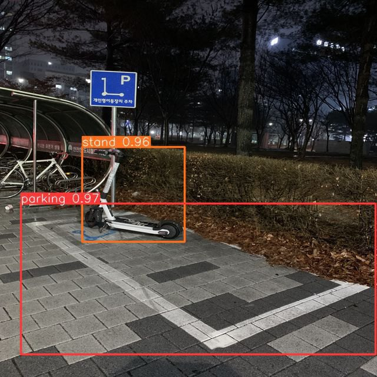
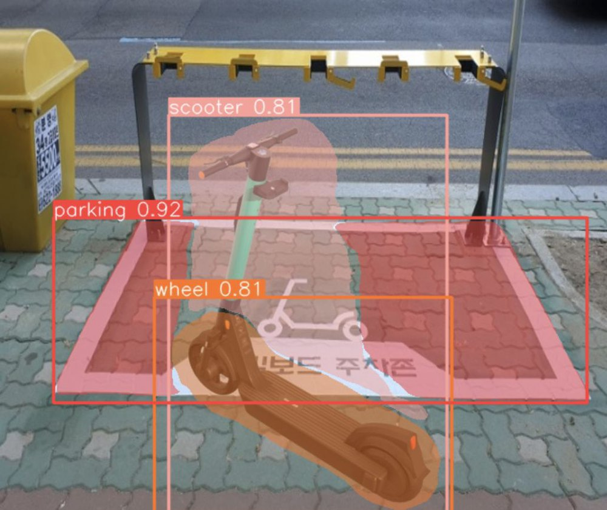
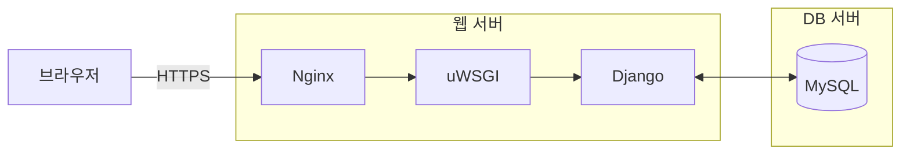

<div align="center">

# 킥킥파크 — 공유 킥보드 주차 상태 분석 시스템
### 사진 한 장으로 주차 상태를 판정하고, 바르게 세운 사용자에게 점수를 주는 서비스

**멀티캠퍼스 K-Digital Training 「멀티잇 데이터 분석&엔지니어(Python)」 31회차 최종 프로젝트**<br>
**기업 요구사항 기반 문제해결 프로젝트 최우수상**


<br>


</div>

> **English summary** — Shared e-scooters are unpopular in Korea mostly because of reckless parking. We first explored Seoul open data (floating population, public-bike usage, towing records, parking zones) to find where parking spaces should go, then **pivoted to judging each return photo**: over six iterations (YOLOv5 → YOLOv8 → Mask R-CNN, 1,429 self-labelled photos) the model learned to locate the *parking area*, the *scooter* and its *wheels* and decide whether the scooter is **standing or fallen, inside or outside** the zone. A rule-based score (up to 20 points) feeds a **points-and-ranking web service** (Django) that rewards good parking — a small gamification loop for a civic problem. Grand Prize of the Multicampus final project.

---

## 목차
1. [문제 정의](#1-문제-정의)
2. [1단계: 어디에 주차장을 둘까 — 탐색적 분석](#2-1단계-어디에-주차장을-둘까--탐색적-분석)
3. [방향 전환](#3-방향-전환)
4. [2단계: 제대로 세웠는가 — 주차 상태 판정 모델](#4-2단계-제대로-세웠는가--주차-상태-판정-모델)
5. [점수 규칙](#5-점수-규칙)
6. [웹 서비스](#6-웹-서비스)
7. [실행 방법](#7-실행-방법)
8. [나의 역할](#8-나의-역할)
9. [회고](#9-회고)

---

## 1. 문제 정의

| | |
|---|---|
| **WHY** | 공유 PM(개인형 이동장치) 서비스는 빠르게 컸지만 시민 인식은 나쁘다. 가장 큰 이유는 **빠른 속도**와 **아무 데나 세워 두는 주차**다. |
| **WHAT** | 주차 질서를 잡으면서도 **PM 이용률은 떨어뜨리지 않는** 방법이 필요하다. |
| **HOW** | 데이터로 주차 공간을 찾고, 사용자가 올바르게 주차하도록 **동기를 주는 서비스**를 만든다. |

## 2. 1단계: 어디에 주차장을 둘까 — 탐색적 분석

서울 열린데이터광장, 공공데이터포털, TAAS에서 PM 사고·견인 현황, 전동킥보드 주차구역, 생활인구, 지하철 승하차, 버스정류장, 상권 유동인구, 공공자전거(따릉이) 데이터를 모았다.

- **종속변수 대용치 — 따릉이 대여 건수.** 킥보드 시장은 여러 업체로 나뉘어 이용 데이터를 구할 수 없었다. 따릉이는 ① 같은 공유 서비스로서 대여·반납 입지가 중요하고, ② 한국인이 가장 많이 쓰는 공유 모빌리티 앱이며, ③ 선행연구에서 킥보드 통행과 마찬가지로 유동인구와 관련이 확인됐다.
- **자치구·행정동 선정.** 견인 건수, 대중교통 승하차 인원, 주 이용층(10~30대) 대비 주차구역 수, 대학 수, 상권 밀집도로 우선순위를 매겨 **강남구**를 고르고, 그 안에서 행정동을 좁혔다.

<table>
<tr>
<td width="50%"></td>
<td width="50%"></td>
</tr>
<tr>
<td width="50%"></td>
<td width="50%"></td>
</tr>
<tr>
<td colspan="2" align="center"><sub>행정동 선정 과정 시각화 (Tableau)</sub></td>
</tr>
</table>

## 3. 방향 전환

입지 모델(K-Means, 회귀, MCLP, P-median)을 설계하던 중, 입지 분석만으로는 사용자의 주차 습관을 바꾸기 어렵다고 판단해 질문을 바꿨다 (2024.02.17).

> "**어디에** 주차장을 더 둘까?" → "사용자가 **제대로** 세웠는가, 그리고 어떻게 **제대로 세우게** 만들까?"

주차 공간을 늘려도 아무 데나 세우는 습관은 남는다. 그래서 반납할 때 찍는 **사진 한 장으로 주차 상태를 판정**하고, 결과를 **점수와 랭킹**으로 돌려주는 쪽으로 바꿨다.



## 4. 2단계: 제대로 세웠는가 — 주차 상태 판정 모델

라벨 설계를 여섯 번 바꾸며 모델을 고쳤다.

| 차수 | 모델 | 데이터 | 라벨 | 결과와 교훈 |
|:---:|---|---|---|---|
| 1 | YOLOv5 | Roboflow 공개 데이터 (킥보드 2,524장 · 주차장 3,123장) | scooter / empty / occupied | 킥보드와 주차선을 따로 학습한 뒤 합치는 전이학습이 비효율적 → 실패 |
| 2 | YOLOv5 | 자체 제작 데이터셋 600장 (Labelme 라벨링) | parking / in / out | 킥보드와 주차장을 다른 박스로 잡으니 **둘의 관계가 학습되지 않음** |
| 3 | YOLOv8 | 자체 제작 1,429장 (증강) | parking / in / out | 킥보드와 주차장을 **한 박스로** 묶자 in/out이 잘 학습됨 |
| 4 | YOLOv8 + YOLOv8 | 1,429장 | in/out 모델 + parking / stand / fall 모델 | 좌표를 이용해 **서 있음/넘어짐**까지 판정 |
| 5 | YOLO segment + Mask R-CNN | 1,429장 | parking / scooter / wheel | 픽셀 단위 분할로 바퀴 위치 파악 |
| 6 | YOLOv8 + Mask R-CNN | 1,429장 | parking / scooter / wheel | YOLOv8로 박스를 찾고 Mask R-CNN으로 분할 |

<table>
<tr>
<td width="33%"></td>
<td width="33%"></td>
<td width="33%"></td>
</tr>
<tr>
<td align="center"><sub>4차 · 주차구역 + 서 있음</sub></td>
<td align="center"><sub>4차 · 야간 촬영</sub></td>
<td align="center"><sub>5차 · parking / scooter / wheel 분할</sub></td>
</tr>
</table>

## 5. 점수 규칙

탐지한 **parking(주차구역) · scooter(킥보드) · wheel(바퀴)** 로 상태를 정한다.

- **서 있음 / 넘어짐**: 킥보드 박스의 가로가 세로보다 길면 넘어짐, 짧으면 서 있음
- **주차구역 안 / 밖**: 주차구역 안에 바퀴가 있는지와 킥보드의 위치로 주차 적합도(0–100)를 매김

| 주차 적합도 | 구역 안 · 서 있음 | 구역 안 · 넘어짐 |
|---|:---:|:---:|
| 91–100 (매우 적합) | **20** | 18 |
| 70–90 (적합) | 16 | 14 |
| 41–69 (보통) | 12 | 10 |
| 11–40 (미흡) | 8 | 6 |
| 0–10 (부적합) | 4 | 2 |
| **구역 밖** (적합도 무관) | 4 | 2 |

같은 적합도라면 서 있는 쪽에 2점을 더 주고, 구역 밖은 최저점만 준다. 구역 안에 바르게 세울수록 점수가 커지도록 설계했다.

## 6. 웹 서비스

이 저장소는 서비스의 Django 웹 애플리케이션이다.

| 앱 | 기능 |
|---|---|
| `accounts` | 회원가입·로그인 (커스텀 User 모델) |
| `app1` | 반납 사진 업로드 (640×640 리사이즈, EXIF 회전 보정), 업로드 시 점수 적립 |
| `ranking` | 누적 점수 순위, 상위 3명 금·은·동 메달 카드 |
| `mypage` | 내 업로드 기록(사진·시간)과 누적 점수 |
| `map` | Kakao 지도로 현재 위치 표시 |
| `chatbot` | OpenAI GPT-3.5 챗봇 |

**배포 구성 (발표 기준)**



> 저장소 기본 설정은 로컬 실행용 SQLite다. 판정 모델은 Colab에서 따로 학습했고, 모델 가중치와 추론 연동 코드는 이 저장소에 없다. 지금 코드는 사진을 올릴 때마다 고정 점수(+10)를 쌓으며, 위 점수 규칙은 발표에서 제안한 설계다.

## 7. 실행 방법

```bash
git clone https://github.com/Lunecid/MultiCamp_Final.git
cd MultiCamp_Final
python -m venv .venv && source .venv/bin/activate   # Windows: .venv\Scripts\activate
pip install -r requirements.txt
cp .env.example .env    # DJANGO_SECRET_KEY, OPENAI_API_KEY, KAKAO_JS_KEY 입력
python manage.py migrate
python manage.py runserver
```

API 키는 코드에 넣지 않고 `.env`로만 관리한다.

## 8. 나의 역할

5인 팀에서 다음을 맡았다.

- **탐색적 시각화**: 자치구·행정동 선정 과정을 Tableau 지도와 차트로 시각화 (위 1단계 그림)
- **데이터 전처리**: 서울시 공공데이터 수집·정제
- **웹사이트 구축**: Django 기반 서비스 화면과 기능 구현

## 9. 회고

- **질문을 바꾸는 용기.** 입지 분석을 붙잡고 있었다면 모델링은 더 쉬웠겠지만, 사용자 행동을 바꾸는 서비스는 나오지 않았다. 문제를 다시 정의하는 게 모델을 고치는 것보다 효과가 컸다.
- **라벨 설계가 성능을 갈랐다.** 2차에서 3차로 넘어가며 모델(YOLOv5→v8)과 데이터 양도 바뀌었지만, 팀이 꼽은 결정적 차이는 킥보드와 주차장을 한 박스로 묶은 라벨 단위였다.
- **보상 설계.** 점수와 랭킹으로 바른 행동을 끌어내는 구조는 게임 디자인과 닮았다. 다시 한다면 점수 도입 전후의 주차 품질을 A/B 테스트로 비교해 보고 싶다.

---

<sub>팀 프로젝트 산출물입니다. 팀원의 개인정보 보호를 위해 이름은 적지 않았습니다. · 문의: [GitHub @Lunecid](https://github.com/Lunecid)</sub>
